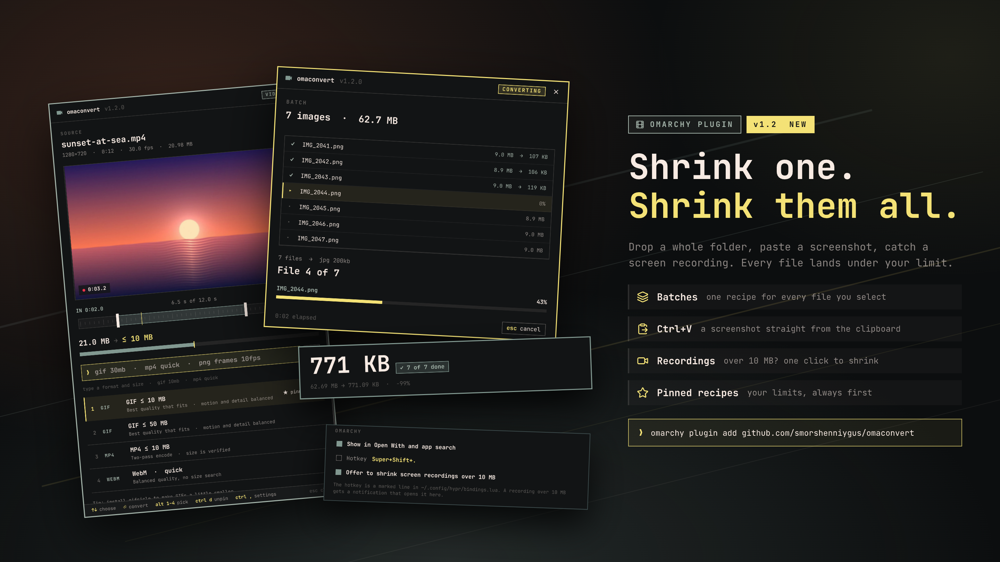

# OmaConvert guide

Everything the [README](../README.md) leaves out.

## Using the window



1. **Choose a file.** Click the Source field, press Enter, drop a file onto it, use Open With, or press **Ctrl+V**: a screenshot or copied image (saved to `~/Pictures/OmaConvert/`), a file copied in the file manager or a path all open as the source.
2. **Trim** a video on the edit track under the preview. The preview follows the handle you move, and the size limit applies to the trimmed part.
3. **Pick a recipe**, or type in the `❯` line above the list. The size bar shows the source against the limit, so you see how much has to go.
4. **⚙ settings** (Ctrl+,) opens every field: format, mode, max size with presets (Discord 10 MB, X GIF 15 MB, email 25 MB, web 500 KB), GIF preference, quick quality, frame rate for sequences and the output folder. The fields and the line stay in sync, and **Will make** shows the file name you will get.

**Several files at once.** Select files in the file manager and use Open With, drop or paste several files, or pick several in the dialog. They open as a **batch**: one list with each file's size, one recipe for all of them, converted one after another. A file that cannot be read is marked and skipped, and files of the other kind (videos in a batch of images) are left out. Trimming is for one video at a time.

**Pin the recipes you use.** Ctrl+D (or ★ pin next to Convert in the settings) pins the highlighted recipe, such as `jpg 150kb` for your website. Pinned recipes are listed first for that kind of file, up to six of them. Ctrl+D again unpins.

While it converts, you see each size the search measured against the limit. Afterwards you get the measured size, whether it fits, Before/After thumbnails and keyed actions.

What the command line understands:

| Type | Meaning |
|---|---|
| `gif`, `mp4`, `webm`, `mkv`, `mov`, `png`, `jpg`, `webp`, `bmp`, `tiff` | output format |
| `30mb`, `500kb`, `0.5mb` | target size (1 MB = 1,000,000 bytes) |
| `quick`, `quick small`, `quick high` | no size search, just a quality preset |
| `motion`, `detail` | for GIFs, what to keep when shrinking: smooth motion or a sharp picture |
| `frame` | one still from a video (the trim start) |
| `frames`, `frames 10fps` | PNG sequence in a new `<name>-frames` folder |

Russian words work too: `гифка`, `кадр`, `кадры`, `мб`, `кб`.

Keyboard (the bar at the bottom of the window always shows the keys that work right now):

| Where | Keys |
|---|---|
| Empty window | Enter browse · Ctrl+V paste |
| Recipes | ↑↓ choose · Enter convert · Alt+1…9 run a recipe · Ctrl+D pin or unpin · Ctrl+, settings · Ctrl+V paste another file |
| Settings | Tab next field · ←→ or h/l choose · Ctrl+D pin or unpin · Ctrl+Enter convert · Esc back to recipes |
| Converting | Esc cancel |
| Result | Enter open · O folder · C copy file · P copy path · N convert another (batch: Enter folder · C copy all · P all paths) |

Esc otherwise clears the line or closes the window. If the window is fullscreen, it stays fullscreen after the file dialog closes.

## Omarchy integration

The empty window has three switches. Each is off until you turn it on, except the last one, and each is undone the same way.

- **Show in Open With and app search** adds OmaConvert to your file manager's Open With menu.
- **Hotkey** adds one marked line to `~/.config/hypr/bindings.lua` on the first free combination (`Super+Shift+.` if it is free) and reloads Hyprland. Switching it off removes exactly that line.
- **Offer to shrink screen recordings over 10 MB** (on by default) watches for the end of an Omarchy screen recording. If the video is over 10 MB, a notification offers to open it in OmaConvert.

Screenshots need no switch: Omarchy puts them on the clipboard, so `Print Screen`, the OmaConvert hotkey, `Ctrl+V`, `jpg 200kb`, `c` is the whole round trip.

## How Target Size works

The tool aims at 97% of the limit. MP4 and WebM use two-pass encoding with a corrective pass when needed. The resolution follows the bitrate: the tool picks the largest standard size (1080p, 720p, 540p, 480p, 360p…) that still gets enough bits per pixel. These steps were tuned with VMAF on real footage, because a smaller frame with enough bits looks better than a large starved one. GIF size cannot be predicted from a bitrate, so OmaConvert samples the start, middle and end of the clip, then tries profiles that lower the resolution, frame rate and palette. The Motion or Detail preference decides which of these goes first. Images step down quality and then dimensions. Every candidate is measured, and a result over the limit is never published. If the target is impossible, you get an error instead of a file. The source is never modified, and existing files are never overwritten: the result is named after the target, such as `clip-50mb.gif` or `photo-200kb.jpg`, and gets a number (`clip-50mb-2.gif`) if that name is taken.

## What it runs and writes

- It runs only `ffmpeg`, `ffprobe`, and `gifsicle` if installed, all on your machine. Nothing is uploaded and there is no telemetry.
- Converted files go next to the source, or into the folder chosen under **Save to**.
- Preferences: `~/.config/omaconvert/preferences.ini`. It stores the last recipe and other settings, plus the output folder only if you ask it to remember it. File names are never saved.
- Preview thumbnails: `~/.cache/omaconvert/previews`, at most two small PNGs, readable only by you (0600 in a 0700 folder). They are deleted when the preview is cleared or the window closes.
- Results are never readable by more people than their source: converting a private (0600) file gives a private file.
- Only after you switch on Open With: `~/.local/share/applications/io.github.smorshenniygus.omaconvert.desktop`. Switching it off removes the file.
- Only after you switch on the hotkey: a block between `-- >>> OmaConvert hotkey` and `-- <<< OmaConvert hotkey` in `~/.config/hypr/bindings.lua`.
- Pasted images: `~/Pictures/OmaConvert/pasted-<date>.png`. To spot the end of a screen recording it reads Omarchy's `/tmp/omarchy-screenrecord-filename` every two seconds; it never touches the recording.

No root access or package installation is needed.

## Command line

The panel drives a small CLI. You can use it directly from `~/.config/omarchy/plugins/io.github.smorshenniygus.omaconvert/bin/omaconvert`:

```bash
omaconvert 'my video [1].mp4' --format gif --max-size 50MB
omaconvert long.mp4 --format mp4 --max-size 20MB --trim-start 12.5 --trim-end 30
omaconvert photo.png --format jpg --max-size 200KB --output-dir ~/Pictures/share
omaconvert video.mov --format webm --preset small
omaconvert video.mp4 --format png --sequence --sequence-fps 10
omaconvert *.png --format jpg --max-size 200KB --output-dir ~/Pictures/web   # a batch
omaconvert --capabilities      # which formats this FFmpeg can write
```

Every stdout line is a JSON event: `probe`, `analyzing`, `candidate`, `encoding`, `optimizing`, and finally `complete`, `error` or `cancelled`. The `complete` event carries the output path and measured size. Ctrl+C or SIGTERM stops the job and its encoders. A stalled encode is stopped after 300 seconds without progress; set `OMACONVERT_STALL_TIMEOUT` to change this, or to `0` to disable it.

## Development

```bash
scripts/check.sh
```

This runs the Python tests, the Qt Quick tests, `omarchy plugin validate` on the git-tracked files, and `qmllint` against the installed shell. The Python tests encode real clips with FFmpeg. They check byte limits, Unicode and bracketed file names, safe publishing on filesystems without hard links, cancellation and hung tools.

After a change to the installed plugin, run `omarchy plugin update io.github.smorshenniygus.omaconvert --yes`, then `omarchy restart shell`. The shell caches plugin QML, and the window shows a warning while the loaded interface is older than the backend.
